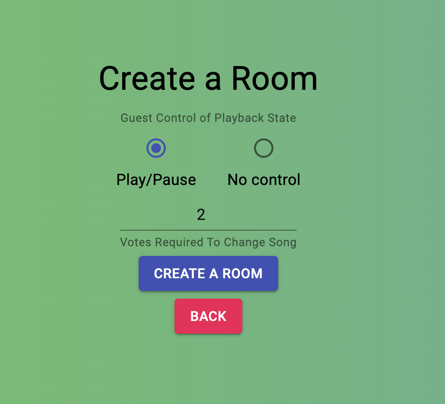

# Spotter

## Welcome to Spotter!

*I really need a better name. Please create an issue on GitHub or post a comment on Replit if you have an idea of a better one.*

Spotter is a website that you can connect to Spotify to control your music with an extremely simple, easy-to-use interface.

Spotter lets you generate a room that you can invite other people to to control your music with you. With a voting system for skipping and rewinding songs, you could use it at a party so that the guests can control the music!

## Features

* View song, and album cover
* View timeline for song
* Voting system for skipping to previous song, and next song *Can be set to one if you want it to be clicked once.*
* Shuffle Button
* Repeat button *Goes through the 3 states of repeating like in Spotify app*
* Pause/Play button
* Settings page where you can control the amount of votes, and whether guests can pause
* Fully functioning Room Join/Create system
* Changing gradient background
* Auto refreshing Spotify Tokens
* Backwards-Compatability for browsers with older versions of JavaScript

## Creating a room

[Create Room](https://spotter.dillonb07.repl.co/create)

When you create a room, you can choose the following settins:
* Guest can pause
* Votes to previous/skip

You'll also be asked to allow Spotter to have the following permissions:
`user-read-playback-state`, `user-modify-playback-state` and `user-read-currently-playing`
This will allow Spotter to read the currently playing song, see whether it's paused/playing/repeating/shuffled and let Spotter control the song.

***Because we use Spotify's Web API, if you have a Free account, you will not be able to control the playback of the song. You and your guests will only be able to see what's playing, and the timeline for the song.***

Once accepted, you will be redirected back to Spotter, and you should see the music player.

There will be a Settings buton at the bottom of the page, as well as a Leave Room button. The Settings button will allow you to modify whether guests can pause, and the votes to change song. You can also share the code at the top of the page with the people you would like to access the music player.

## Joining a room

[Join Room](https://spotter.dillonb07.repl.co/join)

To join a room, you don't need anything except the room code, *and access to the website of course*.

Just enter the room code on the room join page, and you'll be in the room!

***Note: It is important to go through the room join page instead of going directly to `room/<RoomCode>`, because of backend code that needs to run.***

If you are able to pause, you'll see a pause button. If you can't pause, you won't see the pause button.

Pressing the Skip or Previous buttons will add 1 vote to that button. When the amount of votes is reached, the song will change.

You cannot use the Shuffle or Repeat buttons. These are for the host only to use, but let the guests see the current state.

Repl: https://replit.com/@DillonB07/Spotter
GitHub: https://github.com/dbarnes18/Spotter
Website: https://spotter.dillonb07.repl.co